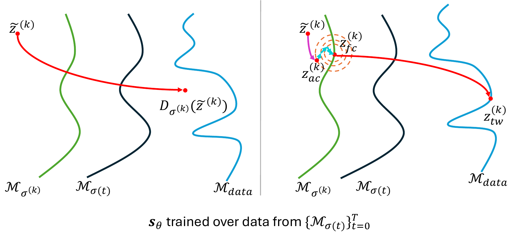
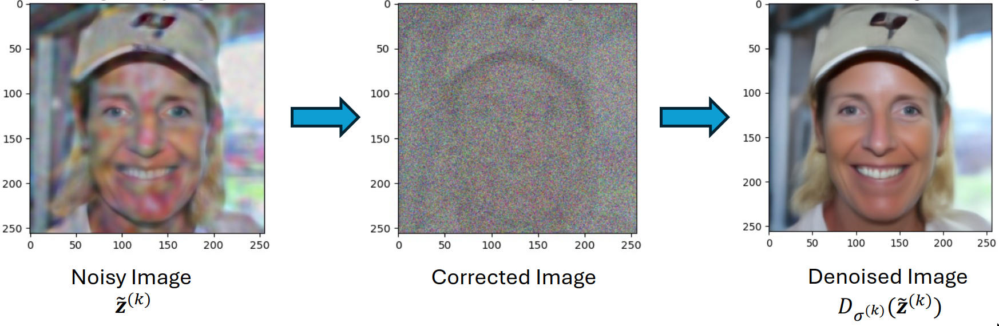
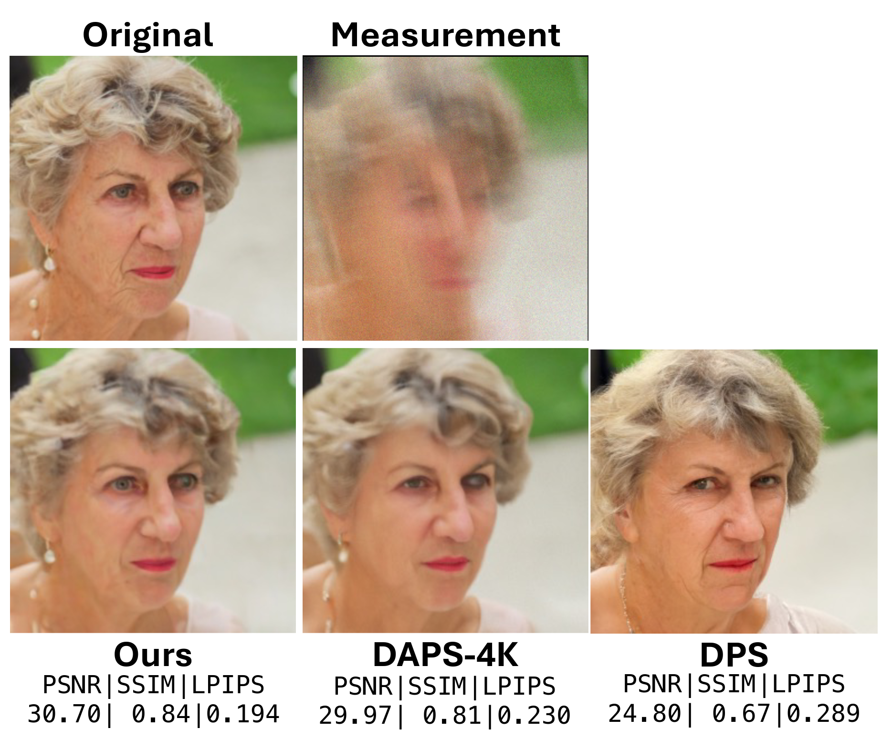
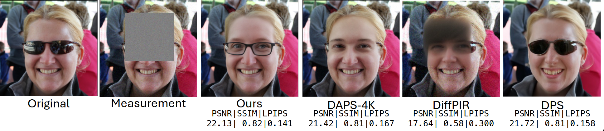

# DiffOps: Taming Score-Based Denoisers in ADMM

Official PyTorch implementation of **Taming Score-Based Denoisers in ADMM: A Convergent Plug-and-Play Framework** by Rajesh Shrestha and Xiao Fu.

Published as a conference paper at **ICLR 2026**.

<p align="center">
  <a href="https://openreview.net/forum?id=BiXwSIIMIq">OpenReview</a> |
  <a href="https://openreview.net/pdf?id=BiXwSIIMIq">Paper PDF</a> |
  <a href="https://arxiv.org/abs/2603.10281">arXiv</a> 
</p>

<p align="center">
  
</p>
<p align="center">
  

</p>

DiffOps implements **ADMM plug-and-play (ADMM-PnP)** with the proposed **AC-DC denoiser**, including both the `Ours-tweedie` and `Ours-ode` variants from the paper.

## Highlights

- **AC-DC denoiser:** a three-stage score-based denoiser for ADMM that combines auto-correction, directional correction, and final score-based denoising.
- **Convergence guarantees:** the paper establishes weakly nonexpansive / bounded-denoiser results that support convergence under constant or adaptive ADMM schedules.
- **Broad inverse-problem coverage:** the codebase includes super-resolution, Gaussian blur, motion blur, box/random inpainting, phase retrieval, nonlinear blur, HDR, and compression-quantization tasks.

## Method Overview

At each ADMM iteration, DiffOps applies the AC-DC denoiser to the denoising subproblem:

1. **Auto-correction (AC):** add Gaussian noise to move the ADMM iterate closer to the noisy manifolds seen during score-model training.
2. **Directional correction (DC):** run short conditional Langevin updates to better align the iterate with the target score manifold while retaining measurement information.
3. **Score-based denoising:** finish with either Tweedie's lemma (`Ours-tweedie`) or ODE-based score integration (`Ours-ode`).

The main entrypoint is:

```bash
python recover_inverse.py --config-name <default>.yaml <Hydra overrides>
```

## Quickstart

All commands below assume you are in the repository root.

### 1. Create the environment

```bash
conda create -n diffops python=3.10 -y
conda activate diffops
pip install -r requirements.txt
```

### 2. Download pretrained checkpoints

Create the score-model checkpoint directory:

```bash
mkdir -p pretrained-models
```

Download the FFHQ checkpoint:

```bash
gdown --id 1BGwhRWUoguF-D8wlZ65tf227gp3cDUDh -O pretrained-models/ffhq_10m.pt
```

Download the ImageNet checkpoint:

```bash
gdown --id 1HAy7P19PckQLczVNXmVF-e_CRxq098uW -O pretrained-models/imagenet256.pt
```

For the `nonlinear_blur` task, also download the BKSE checkpoint:

```bash
mkdir -p measurements/bkse/experiments/pretrained
gdown --id 1vRoDpIsrTRYZKsOMPNbPcMtFDpCT6Foy -O measurements/bkse/experiments/pretrained/GOPRO_wVAE.pth
```

The standard FFHQ / ImageNet demos below do **not** require the BKSE checkpoint. That dependency is only needed for the nonlinear blur operator under [`measurements/bkse/README.md`](measurements/bkse/README.md).

## Out-of-the-Box Demo

The default data configs already point to the bundled sample images in `demo-samples/ffhq` and `demo-samples/imagenet`, so the commands below run without a separate dataset download once the pretrained checkpoints are in place.

### FFHQ 4x super-resolution

```bash
python recover_inverse.py --config-name default_ffhq.yaml
```

### ImageNet 4x super-resolution

```bash
python recover_inverse.py --config-name default_imagenet.yaml
```

### FFHQ phase retrieval

```bash
python recover_inverse.py --config-name default_ffhq.yaml \
  inverse_task=phase_retrieval \
  save_dir=./results/ffhq_phase_retrieval
```

Results are written to the configured `save_dir`. Task, model, dataset, and sampler choices are controlled through Hydra configs in `configs/`.

## Supported Tasks

- `down_sampling`: 4x super-resolution
- `gaussian_blur`: Gaussian deblurring
- `motion_blur`: motion deblurring
- `inpainting`: centered box inpainting
- `inpainting_rand`: random missing-pixel inpainting
- `phase_retrieval`: oversampled phase retrieval
- `nonlinear_blur`: nonlinear blur operator using BKSE
- `hdr`: high dynamic range recovery
- `compression_quantization`: compression / quantization recovery

## Results Snapshot

Table 1 of the paper reports that on **FFHQ**, `Ours-tweedie` reaches **30.439 PSNR** for 4x super-resolution, **32.844 PSNR** for random inpainting, **30.003 PSNR** for motion deblurring, and **27.944 PSNR** for phase retrieval. Across FFHQ and ImageNet, the two AC-DC variants are typically best or second-best in PSNR, SSIM, and LPIPS.

<p align="center">
  
</p>
<p align="center">
  
</p>

For the full quantitative tables, qualitative comparisons, convergence analysis, and additional ablations, see the paper and supplementary material linked above.

## Citation

If you use this repository in your work, please cite the ICLR 2026 paper:

```bibtex
@inproceedings{shrestha2026taming,
  title={Taming Score-Based Denoisers in ADMM: A Convergent Plug-and-Play Framework},
  author={Shrestha, Rajesh and Fu, Xiao},
  booktitle={International Conference on Learning Representations},
  year={2026},
  url={https://openreview.net/forum?id=BiXwSIIMIq}
}
```

arXiv version: <https://arxiv.org/abs/2603.10281>
